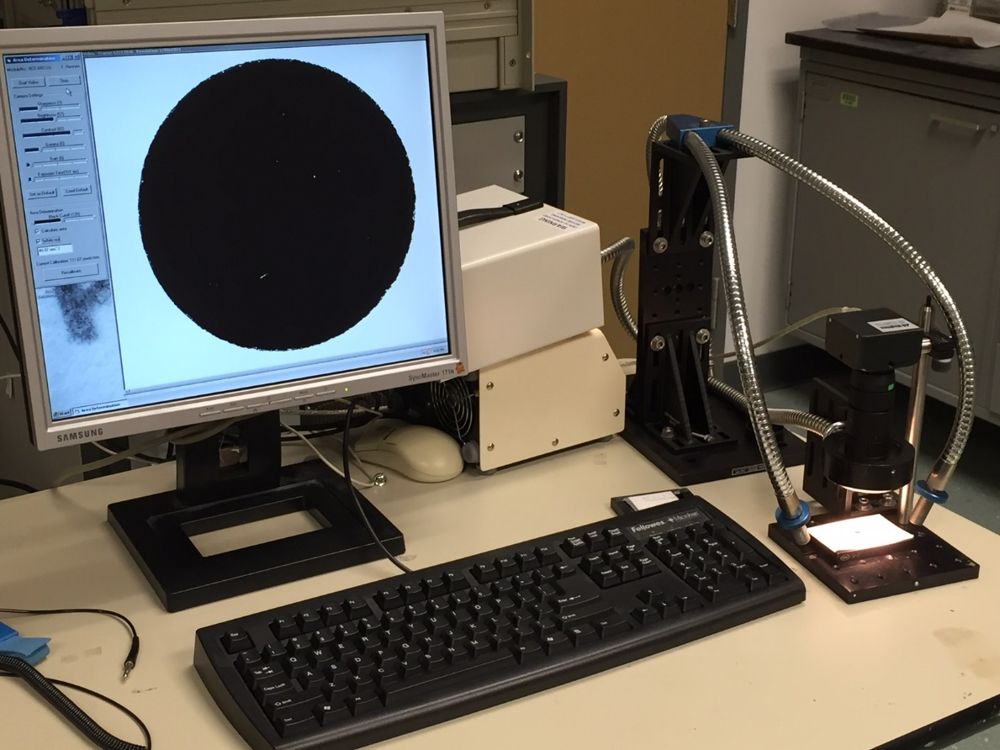

This is a little GUI program I wrote in 2011 to quickly measure surface areas of thin-film samples.  It takes only seconds to measure each sample on a dedicated setup.

The background is that we would cut our samples out of a larger glass substrate into 8 mm circles to fit into a Vibrating Sample Magnetometer (VSM).  Because of inconsistency in the sawing process, the actual sample area varied by ±5%, an error which propogated into the magnetic properties we wanted to measure.  Reducing this error made it possible to resolve the effect of thinner individual layers within the stack.

I programmed this in Visual Basic, having never used that language before or since.  It can be calibrated by setting a ruler in the field of view and clicking on the image where the ruler markings are.  To determine the sample area it uses simple pixel value thresholding, which is good enough under proper illumination.
